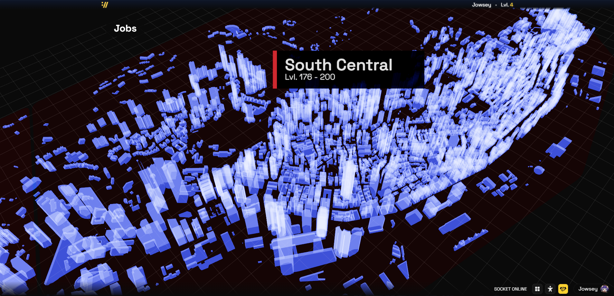

<div align="center">

<br />

<h1>httpunk</h1>
<p>A Cyberpunk-themed web-game.</p>

</div>

## Setup

1. Ensure you have [Bun](https://bun.sh) and [Docker](https://www.docker.com/) installed

2. Install dependencies:

```bash
bun install
```

3. Populate a `.env` based on the provided `.env.example`

4. In your Discord application, add an OAuth2 redirect pointing to `<deployment_url>/api/auth/callback/discord`

5. Initialise Postgres with database schema:

```bash
docker compose up -d postgres # start Postgres
bun run db:push
docker compose stop postgres # optional: stop Postgres for now
```

## Development

Launch Valkey & Postgres, and run the Vite dev server & core backend (--watch) in parallel:

```bash
bun run dev
```

### Database

Generate Better Auth's schema files:

```bash
bun run better-auth:generate
```

Push & migrate schema changes to Postgres:

```bash
bun run db:push
```

## Deployment

Build SvelteKit's Node server:

```bash
bun run build
```

Launch Valkey & Postgres, and run the Node server & core backend in parallel:

```bash
bun run prod
```
